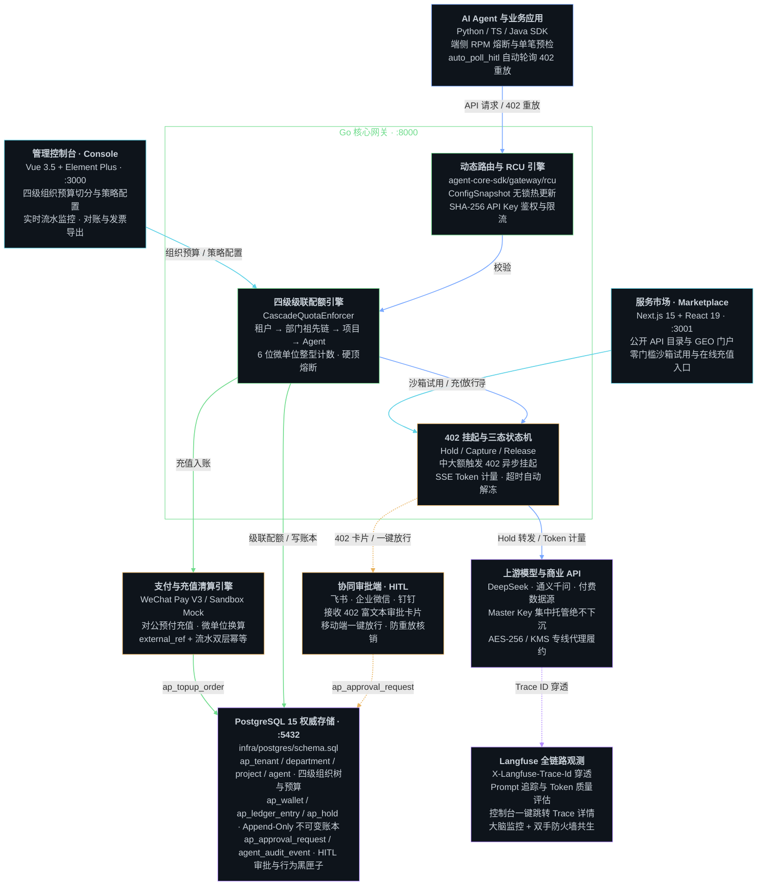

# AgentFinOps 系统架构图

元素：调用方与端侧 ｜ 控制台与门户 ｜ Go 网关数据面 ｜ 风控审批与支付 ｜ 存储与外部上游  
流向：同步请求 / 代理转发 ｜ 管理配置 / 门户调用 ｜ 402 异步挂起 / HITL 审批（虚线） ｜ 三态记账与微单位结算 ｜ Trace 穿透 / 行为审计（虚线）

```mermaid
flowchart TB
  %% AgentFinOps · 企业级 AI Agent 行为审计与资金防火墙网关
  subgraph g_gateway["Go 核心网关 · :8000"]
    rcu["<b>动态路由与 RCU 引擎</b><br/>agent-core-sdk/gateway/rcu<br/>ConfigSnapshot 无锁热更新<br/>SHA-256 API Key 鉴权与限流"]:::core
    quota["<b>四级级联配额引擎</b><br/>CascadeQuotaEnforcer<br/>租户 → 部门祖先链 → 项目 → Agent<br/>6 位微单位整型计数 · 硬顶熔断"]:::core
    sm["<b>402 挂起与三态状态机</b><br/>Hold / Capture / Release<br/>中大额触发 402 异步挂起<br/>SSE Token 计量 · 超时自动解冻"]:::gov
  end
  agent["<b>AI Agent 与业务应用</b><br/>Python / TS / Java SDK<br/>端侧 RPM 熔断与单笔预检<br/>auto_poll_hitl 自动轮询 402 重放"]:::caller
  console["<b>管理控制台 · Console</b><br/>Vue 3.5 + Element Plus · :3000<br/>四级组织预算切分与策略配置<br/>实时流水监控 · 对账与发票导出"]:::app
  market["<b>服务市场 · Marketplace</b><br/>Next.js 15 + React 19 · :3001<br/>公开 API 目录与 GEO 门户<br/>零门槛沙箱试用与在线充值入口"]:::app
  pay["<b>支付与充值清算引擎</b><br/>WeChat Pay V3 / Sandbox Mock<br/>对公预付充值 · 微单位换算<br/>external_ref + 流水双层幂等"]:::gov
  collab["<b>协同审批端 · HITL</b><br/>飞书 · 企业微信 · 钉钉<br/>接收 402 富文本审批卡片<br/>移动端一键放行 · 防重放核销"]:::gov
  upstream["<b>上游模型与商业 API</b><br/>DeepSeek · 通义千问 · 付费数据源<br/>Master Key 集中托管绝不下沉<br/>AES-256 / KMS 专线代理履约"]:::store
  pg["<b>PostgreSQL 15 权威存储 · :5432</b><br/>infra/postgres/schema.sql<br/>ap_tenant / department / project / agent · 四级组织树与预算<br/>ap_wallet / ap_ledger_entry / ap_hold · Append-Only 不可变账本<br/>ap_approval_request / agent_audit_event · HITL 审批与行为黑匣子"]:::store
  langfuse["<b>Langfuse 全链路观测</b><br/>X-Langfuse-Trace-Id 穿透<br/>Prompt 追踪与 Token 质量评估<br/>控制台一键跳转 Trace 详情<br/>大脑监控 + 双手防火墙共生"]:::store
  agent -->|"API 请求 / 402 重放"| rcu
  console -->|"组织预算 / 策略配置"| quota
  market -->|"沙箱试用 / 充值引导"| sm
  rcu -->|"校验"| quota
  quota -->|"放行"| sm
  quota -->|"充值入账"| pay
  sm -.->|"402 卡片 / 一键放行"| collab
  sm -->|"Hold 转发 / Token 计量"| upstream
  pay -->|"ap_topup_order"| pg
  quota -->|"级联配额 / 写账本"| pg
  collab -.->|"ap_approval_request"| pg
  upstream -.->|"Trace ID 穿透"| langfuse
  linkStyle 0 stroke:#79a8ff,stroke-width:1.5px
  linkStyle 1 stroke:#5ad1e6,stroke-width:1.5px
  linkStyle 2 stroke:#5ad1e6,stroke-width:1.5px
  linkStyle 3 stroke:#79a8ff,stroke-width:1.5px
  linkStyle 4 stroke:#79a8ff,stroke-width:1.5px
  linkStyle 5 stroke:#6fdc8c,stroke-width:1.5px
  linkStyle 6 stroke:#e8b25d,stroke-width:1.5px
  linkStyle 7 stroke:#79a8ff,stroke-width:1.5px
  linkStyle 8 stroke:#6fdc8c,stroke-width:1.5px
  linkStyle 9 stroke:#6fdc8c,stroke-width:1.5px
  linkStyle 10 stroke:#e8b25d,stroke-width:1.5px
  linkStyle 11 stroke:#b48cff,stroke-width:1.5px
  classDef caller fill:#0e141b,stroke:#79a8ff,color:#c9d1d9
  classDef app fill:#0e141b,stroke:#5ad1e6,color:#c9d1d9
  classDef core fill:#0e141b,stroke:#6fdc8c,color:#c9d1d9
  classDef gov fill:#0e141b,stroke:#e8b25d,color:#c9d1d9
  classDef store fill:#0e141b,stroke:#b48cff,color:#c9d1d9
  classDef none fill:#0e141b,stroke:#3a4450,color:#c9d1d9
  style g_gateway fill:transparent,stroke:#6fdc8c,stroke-dasharray:0,color:#6fdc8c
```
